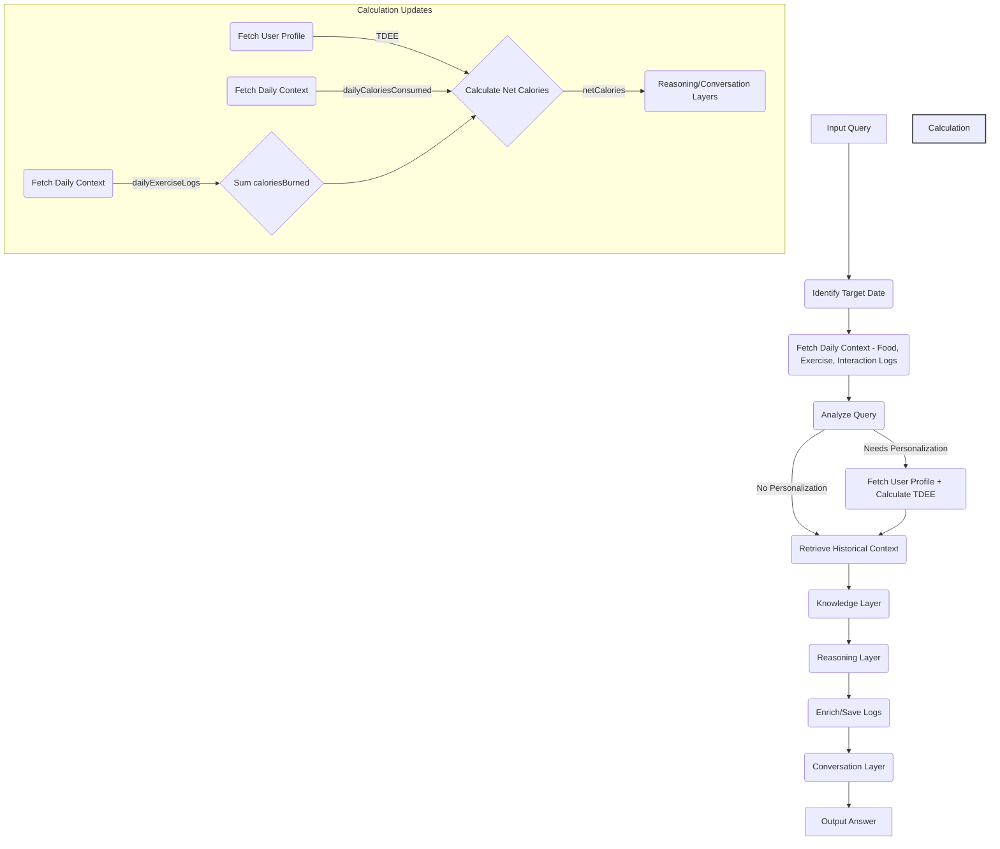

# DailyBalance Answer Engine - Next Steps Plan (2025-04-13)

Following the successful implementation of Guest Mode, this plan outlines the next development phases.

## Phase 1: Enhance Calorie Balance Calculation

**Goal:** Accurately track net calories by incorporating exercise calories burned into the daily balance.

**Steps:**

1.  **Fetch Exercise Calories:** Modify the backend orchestrator (`src/lib/llm/orchestrator.ts`, likely in `fetchDailyContext` or a dedicated step) to retrieve daily exercise logs and sum the `caloriesBurned` field.
2.  **Calculate Net Calories:** Update the calculation logic (likely in `src/lib/llm/reasoning-layer.ts` and potentially passed to `src/lib/llm/conversation-layer.ts`) to compute:
    `netCalories = TDEE - dailyCaloriesConsumed + dailyCaloriesBurned`
3.  **Refactor State & Output:**
    *   Rename the `remainingCalories` field to `netCalories` (or a similar clear term like `calorieBalance`) within the relevant state objects (`AgentState` in `orchestrator.ts`, `ReasoningOutput` derived data, `StructuredAnswer` data summary in `src/types/conversation.ts`).
    *   Update the final response generation logic in `src/lib/llm/conversation-layer.ts` to use this new value and explain the net balance clearly in the answer text.

**Files Potentially Involved:**
*   `src/lib/llm/orchestrator.ts`
*   `src/lib/llm/reasoning-layer.ts`
*   `src/lib/llm/conversation-layer.ts`
*   `src/types/user.ts` (if TDEE source changes)
*   `src/types/conversation.ts` (for `StructuredAnswer`)

**Phase 1 Diagram:**

## Phase 2: Integrate Perplexity Citations

**Goal:** Improve answer trustworthiness by displaying source citations from the Knowledge Layer (Perplexity) within the final answer text.

**Steps:**

1.  **Pass Sources:** Ensure the `sources` array from the `knowledgeResponse` (output of `src/lib/llm/knowledge-layer.ts`) is correctly passed through the orchestrator state to the Conversation Layer.
2.  **Modify Conversation Layer:** Update the prompt engineering or logic within `generateFinalResponse` (`src/lib/llm/conversation-layer.ts`) to intelligently weave citation markers (e.g., `[1]`, `[2]`) into the generated answer `text` where the information from a source is used.
3.  **Modify Frontend:** Update the `AnswerCard` component (`src/components/answer-engine/answer-card.tsx`) to render the list of full sources (`Source[]`) below the answer text, corresponding to the inline citation markers.

**Files Potentially Involved:**
*   `src/lib/llm/orchestrator.ts`
*   `src/lib/llm/reasoning-layer.ts` (if needed to pass sources through)
*   `src/lib/llm/conversation-layer.ts`
*   `src/components/answer-engine/answer-card.tsx`
*   `src/types/conversation.ts`

## Phase 3: UI/UX Enhancements (Future)

*   Implement chat threading grouped by days.
*   Implement application navigation as new sections/pages are developed.

## Deferred Items

*   Manual logging of food/exercise.
*   Adding a specific "target calories burned" goal (can be added after net calculation is working).
